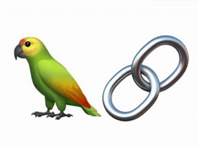
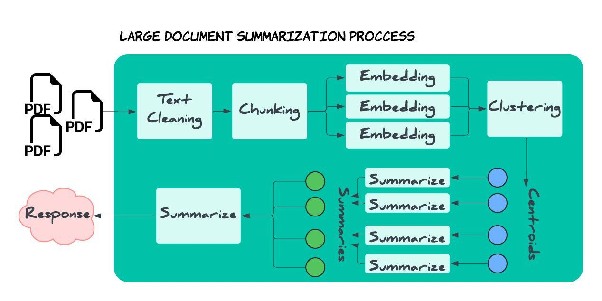
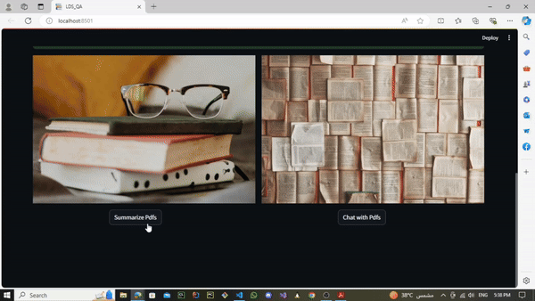
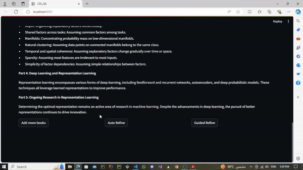
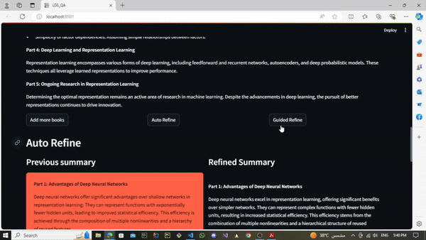
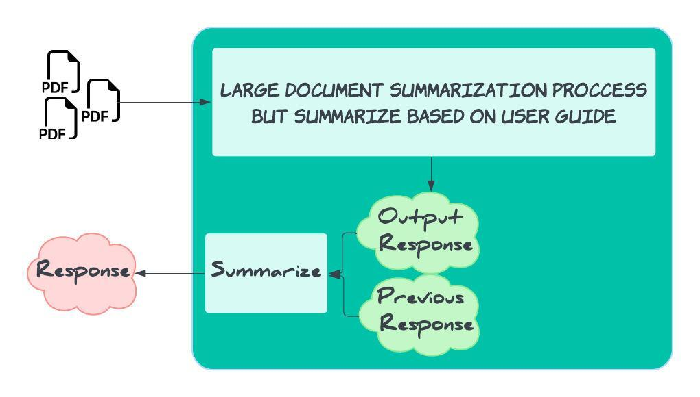
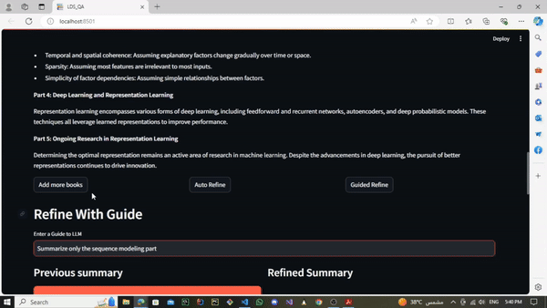

# Large Document Summarization and Chat with PDFs

## Overview
This project provides a comprehensive solution for summarizing large documents and interacting with them in a conversational manner. Our application leverages the power of AI to automatically summarize one or more large documents, refine the summaries based on user input, and even engage in chat-like conversations with PDFs.

---
## Technical Details
         

### Our application is built using the following technologies:

[**Python**](https://www.python.org/): The primary programming language used for development.  
[**Langchain**](https://www.langchain.com): A powerful library for natural language processing tasks.  
[**Gemini API**](https://ai.google.dev/gemini-api/docs): An LLM API that I used for summarization and Embedding.  
[**FAISS**](https://faiss.ai/): A library for efficient similarity search and clustering.  
[**Streamlit**](https://streamlit.io/): A popular framework for building and deploying web applications.  

---
## Key Features

- [**Multi/Large Document Summarization**](#f1): Upload one or more large documents and receive a concise summary of the content.  
- [**Automatic Summary Refining**](#f2): Ask the model to refine the summary automatically for improved response.  
- [**Guided Summary Refining**](#f3): Provide guidance to the model to refine the summary based on your specific needs.  
- [**Cumulative Summarization**](#f4): Add more documents to be summarized in a cumulative way, allowing for a comprehensive understanding of multiple documents.  
- [**Chat with PDFs**](#f5): Engage in conversational interactions with PDFs, exploring their content in a more intuitive and interactive way.
---

## How to get started

* Clone the repository and replace `<REPO_LINK>` by the link to clone 
```
git clone <REPO_LINK>
```  
* Install the required dependencies using
* Run the application using
```
pip install -r requirements.txt
streamlit run main.py
```  
* You may need to change API Key, you can replace the `<YOUR_KEY>` with you actual API key in `.env` file in `src` directory.
```
GOOGLE_API_KEY = <YOUR_KEY>
```
 
---
<a name="f1"></a>
# Usage
## 1) Multi/Large Document Summarization

<p align="center">
 
</p>

### Our summarization workflow involves the following steps:

**Document Upload**: Upload the one ore more document with less than 2000 pages to be summarized.  
**Text Cleaning**: Clean the text to remove unnecessary characters, links and formatting.  
**Text Chunking**: Break the text into smaller chunks for more efficient processing.  
**Clustering**: Cluster the chunked text to identify key topics and themes.   
**Centroid Summarization**: Summarize the centroids of each cluster to capture the main ideas.  
**Final Summarization**: Summarize the summaries to provide a concise overview of the entire document.  

<p align="center">
 
</p>

---
<a name="f2"></a>
## 2) Automatic Summary Refining

Here you can ask the model to refine the summary automatically.   
The refined response has more simple words and sentences for better understanding.

<p align="center">
 
</p>

---

<a name="f3"></a>
## 3) Guided Summary Refining
Here you can give a guide or rule to the model about how to summarize or any needed rules.   
The refined response follows user guide.  
for EX: you can ask the model to summarize specific part of the document, pay more attention to a specific part, translate etc...

<p align="center">
 
</p>


---

<a name="f4"></a>
## 4) Cumulative Summarization

<p align="center">
 
</p>

The key point here is the reduction of time by not re-summarize the documents that was uploaded before.

**As shown in the above diagram**:
- User upload new document to be summarized.  
- Model summarize the document using large document summarization approach that was described before.
- Model combine the output summary from uploaded documents with the previous summary.
- Then model summarize the combined summary in a cumulative manner.     

<p align="center">
 
</p>

---

<a name="f5"></a>
## 5) Chat with PDFs

The last feature is that you can chat with the PDFs you have just uploaded.  
 
- At the first of the program the documents was loaded to a vactor database.  
- The vector database store the documents in an efficient manner by using embedding which helps in fast retreival.  
- When you ask a question the model use the vector database to retreive the response.

<p align="center">
 
</p>

---
